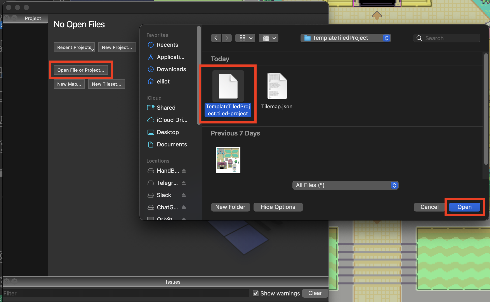
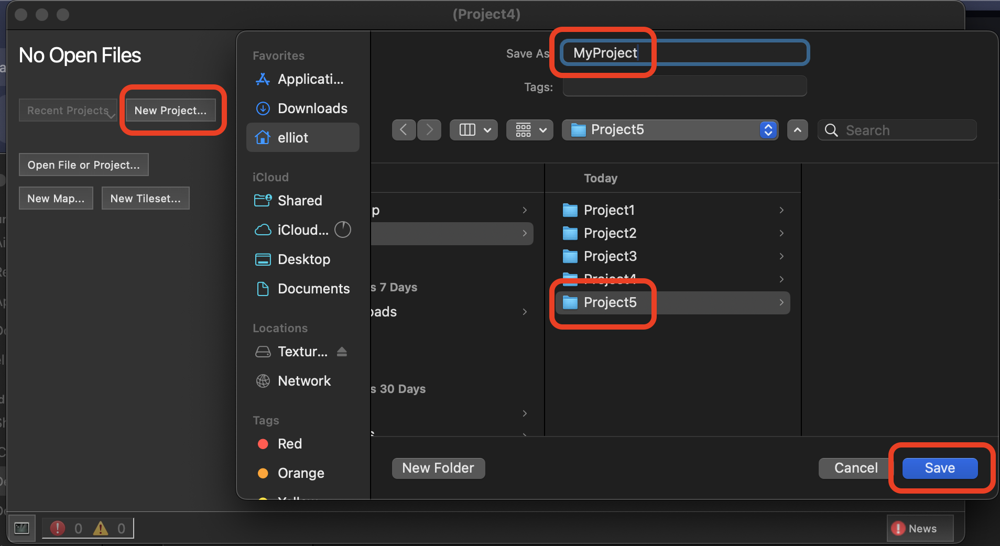
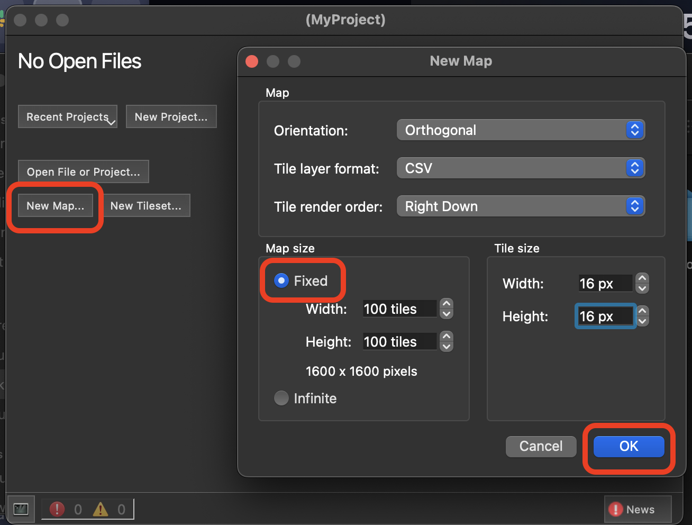
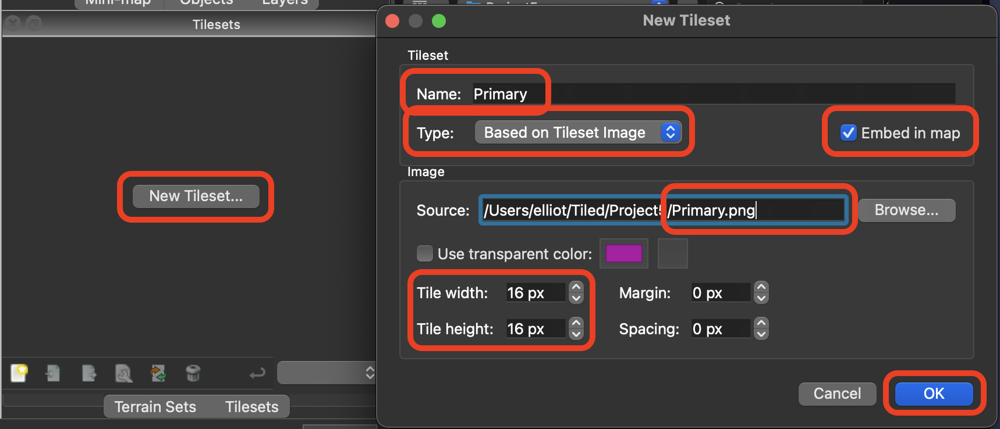
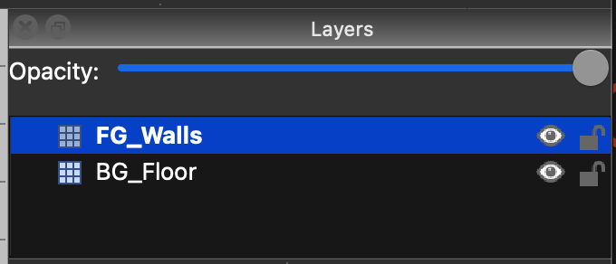
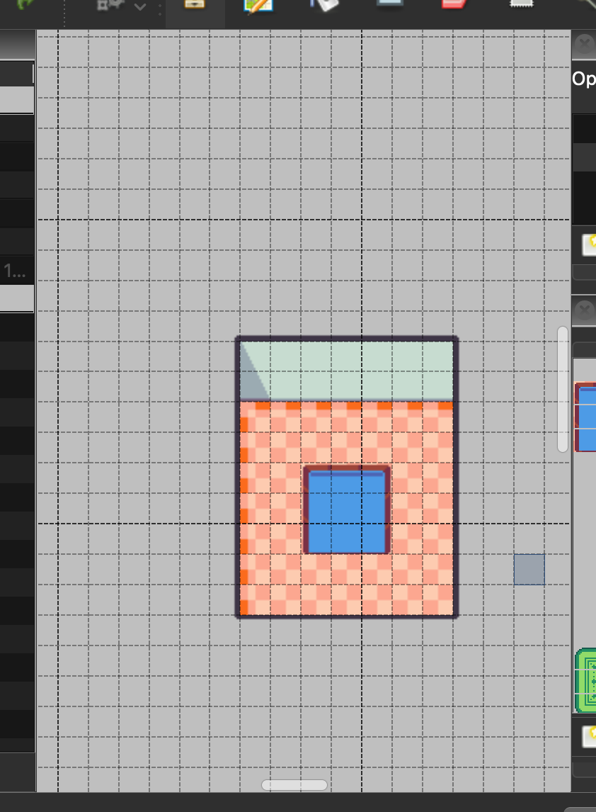
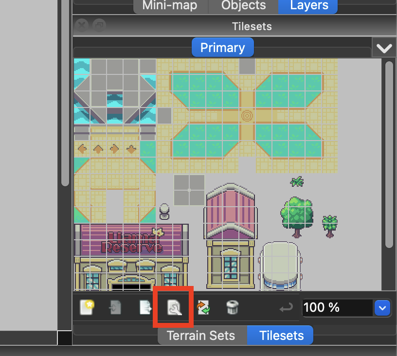
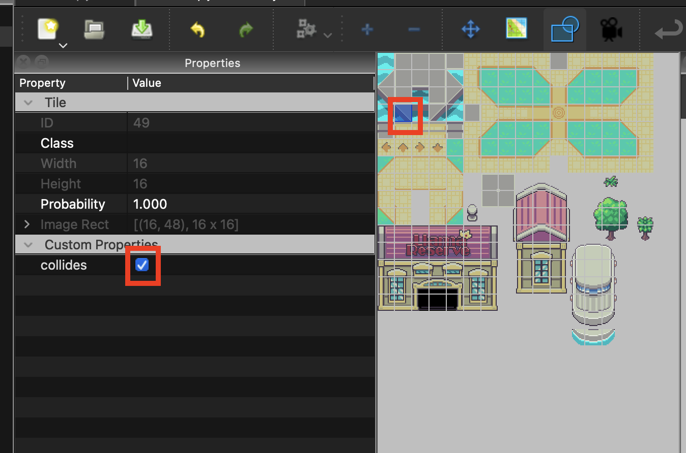

# World Guide

<!--
> [!NOTE]
> You can now use the [`@reality/api`](https://apm.betteridea.dev/pkg?id=UEtFZarBGFKXjyNEHFm5JagOBW7Frij8ojk7BjkSbVE) APM package for the most streamlined way to dive into `Reality`.
-->

The goal of this guide is to get you started developing your own World on the Reality protocol. We will begin by creating our own World process based on a template, and then customizing it.

For more details on the Reality protocol, please see the [Reality Docs](./Reality.md) or [Reality.lua](../process/blueprint/Reality.lua) source code.

## Creating your own World Process

### Prerequisites

- Familiarity with `ao` and `aos`. See the [ao cookbook](https://cookbook_ao.arweave.dev/welcome/index.html) for more information.

### Setup

1. Download the [`DbAdmin`](../process/blueprint/DbAdmin.lua) package source, [`Reality.lua`](../process/blueprint/Reality.lua) protocol source and the [`WorldTemplate.lua`](./src/WorldTemplate.lua) config into the same folder.
2. In that folder, launch a new aos process with sqlite, e.g.:

`aos MyWorldProcessName --module=ghSkge2sIUD_F00ym5sEimC63BDBuBrq4b5OcwxOjiw`

1. Load the `Reality.lua` and `WorldTemplate.lua` files in aos
```
aos> .load Reality.lua
Loaded Reality Protocol
aos> .load WorldTemplate.lua
Loaded World Template
```
> Optional: To enable chat in your world, download the [`Chat.lua`](../process/blueprint/Chat.lua) protocol source and load it as well: `aos> .load Chat.lua`. Most agents will need this enabled to function properly.

1. Enter your new world's process Id in the url of llama land, e.g. [llamaland.arweave.net/#/world/9a_YP6M7iN7b6QUoSvpoV3oe3CqxosyuJnraCucy5ss](https://llamaland.arweave.net/#/world/9a_YP6M7iN7b6QUoSvpoV3oe3CqxosyuJnraCucy5ss)

## Customizing your World

Edit your `WorldTemplate.lua` file to customize your world. After editing the file, you'll have to load it in `aos` again & refresh the viewer webpage for changes to take effect

For example you can move your spawn location to the opposite corner of of the Island:
```lua
RealityParameters = {
  ['2D-Tile-0'] = {
    ...
    Spawn = { 15, 12 },
    ...
  }
}
```

Add in custom background music:
```lua
RealityParameters = {
  ...
  ['Audio-0'] = {
    Bgm = {
      Type = 'Fixed',
      Format = 'WEBM',
      TxId = 'k-p6enw-P81m-cwikH3HXFtYB762tnx2aiSSrW137d8',
    }
  }
}
```

Add a dumb NPC:
```lua
RealityEntitiesStatic = {
  ['MyDumbNPC'] = {
    Type = 'Avatar',
    Position = { 10, 10 },
    Metadata = {
      DisplayName = 'Dummy', -- Dumb NPC name variable
      SpriteTxId = '0WFjH89wzK8XAA1aLPzBBEUQ1uKpQe9Oz_pj8x1Wxpc', -- ID of the spritesheet TX
    },
  }
}
```

or Add a Smart NPC:
```lua
RealityEntitiesStatic = {
  ['MySmartNPC'] = {
    Position = { 10, 10 },
    Type = 'Avatar',
    Metadata = {
      DisplayName = 'Smarty', -- Smart NPC name variable
      SpriteTxId = 'iBDHZ8x4HT5j5c31GDMZo4e-51qbJRcnDNRG8M9a4Fc', -- ID of the spritesheet TX
      Interaction = {
        Type = 'SchemaExternalForm',
        Id = 'Enroll', --Exact name of the schema you intend to load
        Target = 'wTyzABpIyPMbsIQ6uS0MyoATX5ozanppw2Tys0LXqzM', -- Process address that has the schema
      },
    },
  },
```

### Explanation:

- **Dumb NPCs** do not have an `Interaction` field and cannot be interacted with by players. They simply exist as visual elements within the game, and their primary purpose is to contribute to the atmosphere or story.  They have some basic properties like:
  - `Position`: Coordinates in the game world.
  - `SpriteTxId`: Refers to the visual appearance, pointing to a sprite sheet.

- **Smart NPCs** can be interacted with and include an `Interaction` field in their metadata. This interaction works through **SchemaExternalForm**, which allows the NPC to interact with smart contracts or external processes. More details on Schema Forms can be found [here](https://github.com/elliotsayes/Reality/blob/schema-target/docs/Schema.md). Smart NPCs share the same fields as Dumb NPCs, but have an additional `Interaction` field that includes:
  - `Type`: Specifies the type of interaction (in this case, `SchemaExternalForm`).
  - `Id`: The identifier for the interaction.
  - `Target`: The address of the process the NPC interacts with.

## Customizing your Tilemap

To change the art and layout for the map itself, you'll have to update the assets. Let's get creative! You'll need to install the [Tiled](https://www.mapeditor.org/) editor for this part.

### Option A: Starting from the Template Tiled Project

1. Download and extract [TemplateTiledProject.zip](./dl/TemplateTiledProject.zip) into a new folder,and open the project in Tiled.

1. Double click on "Tilemap.json" file in the Tiled editor to edit the map layout

### Option B: Starting a new Tiled Project

1. Create a new empty folder for the project
2. Create a new Tiled project at that empty folder.

3. Create a new map with a fixed size. Use the tile size of the tileset you will use later. Use tile size 16 x 16 pixels.

4. File > Save As... "Tilemap.json" with format "JSON map files"

5. Create a tileset art PNG image and copy it into your Project folder as "Primary.png". Tiles should be 16 x 16 pixels.
6. In the map editor, click "New tileset...". Name it "Primary" & choose the image from your Project folder ("Primary.png"). Make sure the tile size matches that of the map, and "Embed in map" is checked


### Editing your tilemap

1. Customize the tileset art (`Primary.png`) as desired. Tiles should be 16 x 16 pixels.
2. Prefix Background layers with "BG_" & foreground layers with "FG_"

3. Draw your map layers using the tiled editor.

4. To add collision to your map:
   - Click the "Edit Tileset" button
  
   - Select all the tiles, right click "Custom Properties", and add a property of type `bool` named `collides`
  
   - Set the `collides` property to `true` for any tiles you decide
  

### Using your tilemap with your World
1. Remember to save your map file in the Tiled editor.
2. Upload the `Primary.png` & `Tilemap.json` files to Arweave and note the TxIds.
3. Reference these TxIds in your process's WorldParameters global.
   - Update `Tileset.TxId` to `Primary.png`'s TxId
   - Update `Tilemap.TxId` to `Tilemap.json`'s TxId
